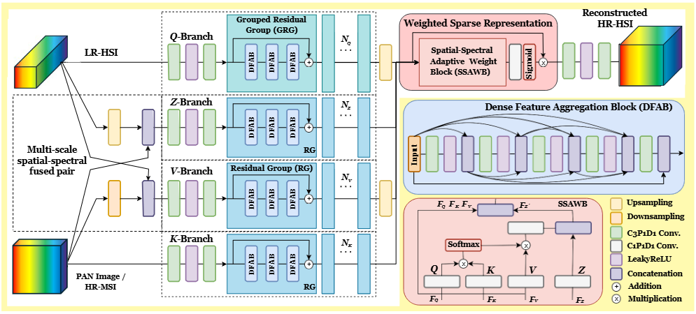
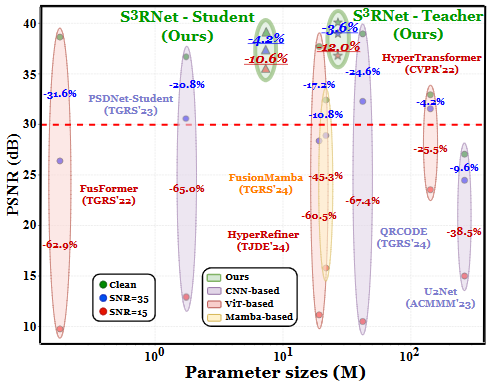

# S³RNet: Sparse Spatial–Spectral Representation with Hybrid Knowledge Distillation for Efficient Multispectral and Hyperspectral Image Fusion

The official PyTorch implementation of "S³RNet: Sparse Spatial–Spectral Representation with Hybrid Knowledge Distillation for Efficient Multispectral and Hyperspectral Image Fusion". Accepted by **Journal of Selected Topics in Applied Earth Observations and Remote Sensing (JSTARS 2026)**.

## [[Paper Link (arXiv)]](https://arxiv.org/abs/2406.19666)

## [[AVIRIS Dataset Link (GoogleDrive)]](https://drive.google.com/drive/folders/10ovLQkVHvNzhXDiEnVGZJdvEMUKsC6Mo)

## [[Pre-trained Teacher Model]](https://drive.google.com/drive/folders/1bFvXC4pqLviSgIuCNVDb9rBriyzTmKj5?usp=sharing) &nbsp; [[Pre-trained Student Model]](https://drive.google.com/drive/folders/1qM5KeAuC44srurE536y8iAbtUH8-x0VR?usp=sharing)

[Chih-Chung Hsu](https://cchsu.info/), [Chia-Ming Lee](https://ming053l.github.io/), Yu-Fan Lin, Chih-Chien Ni, [Li-Wei Kang](https://scholar.google.com/citations?user=QwSzhgEAAAAJ&hl=zh-TW)

Advanced Computer Vision LAB, National Cheng Kung University  
Department of Electrical Engineering, National Taiwan Normal University

---

## Overview

We propose **S³RNet**, a novel framework for multispectral–hyperspectral (MS–HS) image fusion that simultaneously addresses noise robustness, reconstruction fidelity, and computational efficiency. The framework integrates three core components:

- **Multi-Branch Fusion Network (MBFN)**: Parallel Q–K–V–Z branches that capture specialized and complementary spatial–spectral features across different inputs and scales, enabling efficient wide-and-shallow feature extraction amenable to parallel deployment.
- **Dense Feature Aggregation Block (DFAB)**: Dense connectivity within each branch for efficient feature reuse, gradient flow, and implicit noise suppression while preserving fine spatial details.
- **Spatial-Spectral Adaptive Weight Block (SSAWB)**: A cross-attention-based fusion module that learns content-adaptive sparse representations, selectively suppressing noisy or unreliable branch contributions and concentrating energy on informative features.

To further improve deployment feasibility, we develop a **Hybrid Online Knowledge Distillation (HOKD)** strategy that co-trains teacher and student networks using a combination of task-specific reconstruction losses (L1, BEBA, SAM) and distribution-matching distillation losses. The resulting student model achieves a 72.2% reduction in parameters and 84.6% reduction in FLOPs relative to the teacher, while maintaining competitive fusion quality and noise robustness.



---

## Performance Evaluation and Complexity Comparison

**Note:** Methods marked with an asterisk (*) are unsupervised approaches. M and G denote 10⁶ and 10⁹, respectively.

| Method | PSNR↑ | SAM↓ | RMSE↓ | PSNR↑ | SAM↓ | RMSE↓ | Params↓ | FLOPs↓ | Run-time↓ | Memory↓ |
|---|---|---|---|---|---|---|---|---|---|---|
| | **4 Bands LR-HSI** | | | **6 Bands LR-HSI** | | | | | | |
| PZRes-Net | 34.963 | 1.934 | 35.498 | 37.427 | 1.478 | 28.234 | 40.15M | 5262G | 0.0141s | 11059MB |
| MSSJFL | 34.966 | 1.792 | 33.636 | 38.006 | 1.390 | 26.893 | 16.33M | 175.56G | 0.0128s | **1349MB** |
| Dual-UNet | 35.423 | 1.892 | 33.183 | 38.453 | 1.548 | 26.148 | **2.97M** | **88.65G** | 0.0127s | 2152MB |
| DHIF-Net | 34.458 | 1.829 | 34.769 | 39.146 | 1.239 | 25.309 | 57.04M | 13795G | 6.005s | 14936MB |
| FusFormer | 34.217 | 2.012 | 35.687 | 38.637 | 1.678 | 28.674 | 0.18M | 11.74G | 0.0158s | 5964MB |
| HyperTransformer | 28.692 | 3.664 | 62.231 | 32.954 | 2.568 | 41.256 | 142.83M | 343.96G | 0.0252s | 8104MB |
| HyperRefiner | 33.298 | 2.129 | 38.769 | 37.654 | 1.590 | 29.629 | 19.32M | 94.37G | 0.0237s | 7542MB |
| U2Net | 25.622 | 3.855 | 86.682 | 27.068 | 3.832 | 85.101 | 265.15M | 1931G | 0.1684s | 7506MB |
| QRCODE | 35.361 | 1.623 | 32.711 | 38.948 | 1.148 | 24.617 | 41.88M | 2231G | 0.2452s | 15028MB |
| FusionMamba | 30.741 | 1.978 | 50.744 | 32.407 | 1.540 | 45.774 | 21.68M | 134.47G | 0.0347s | 2446MB |
| *CUCaNet | 28.848 | 4.140 | 71.710 | 35.509 | 2.205 | 38.973 | 3.0M | 40.0G | 2070.01s | - |
| *USDN | 30.069 | 3.235 | 59.071 | 35.208 | 2.650 | 53.987 | 0.006M | 1.0G | 28.83s | - |
| *U2MDN | 30.127 | 3.338 | 61.248 | 33.356 | 2.243 | 41.528 | 0.01M | 4.0G | 547.28s | - |
| PSDNet-Teacher | 27.318 | 3.404 | 200.551 | 28.600 | 3.333 | 189.420 | 3.155M | 723.86G | 0.0261s | 3962MB |
| PSDNet-Student | 35.153 | 1.967 | 64.573 | 38.588 | 1.619 | 52.446 | 3.155M | 663.00G | 0.0354s | 3962MB |
| **S³RNet-Teacher (Ours)** | **35.967** | **1.527** | **30.928** | **40.046** | **1.095** | **23.785** | 26.81M | 941.77G | 0.0134s | 2298MB |
| **S³RNet-Student (Ours)** | 35.544 | 1.643 | 32.308 | 39.153 | 1.205 | 25.080 | 7.44M | 144.77G | **0.0121s** | 2146MB |



---

## Environment

- CUDA >= 11.2
- python == 3.8.18
- pytorch == 1.8.1
- cudatoolkit == 11.3

### Installation

```bash
git clone https://github.com/ming053l/CSAKD.git
conda create --name s3rnet python=3.8 -y
conda activate s3rnet
# CUDA 11.3
conda install pytorch==1.8.1 torchvision==0.9.1 torchaudio==0.8.1 cudatoolkit=11.3 -c pytorch -c conda-forge
cd CSAKD
pip install -r requirements.txt
```

## How To Test

```bash
python test_S3RNet.py
```

## How To Train

```bash
# Train teacher and student jointly via HOKD
python train_S3RNet.py --batch_size 8 --epochs 800 --prefix HOKD_4bn_band4 --msi_bands 4 --device='cuda:0' --lr 1e-4
```

---

## Citations

If our work is helpful to your research, please kindly cite:

```bibtex
@article{hsu2026s3rnet,
  title     = {S$^3$RNet: Sparse Spatial--Spectral Representation with Hybrid Knowledge Distillation for Efficient Multispectral and Hyperspectral Image Fusion},
  author    = {Chih-Chung Hsu and Chia-Ming Lee and Yu-Fan Lin and Chih-Chien Ni and Li-Wei Kang},
  journal   = {IEEE Journal of Selected Topics in Applied Earth Observations and Remote Sensing},
  year      = {2026}
}

@inproceedings{lee2025s3rnet,
  title     = {Robust Hyperspectral Image Pansharpening via Sparse Spatial-Spectral Representation},
  author    = {Chia-Ming Lee and Yu-Fan Lin and Li-Wei Kang and Chih-Chung Hsu},
  booktitle = {Proceedings of the IEEE International Geoscience and Remote Sensing Symposium (IGARSS)},
  pages     = {2196--2201},
  year      = {2025},
  doi       = {10.1109/IGARSS55030.2025.11243541}
}
```

---

## Contact

If you have any questions, please email zuw408421476@gmail.com.
